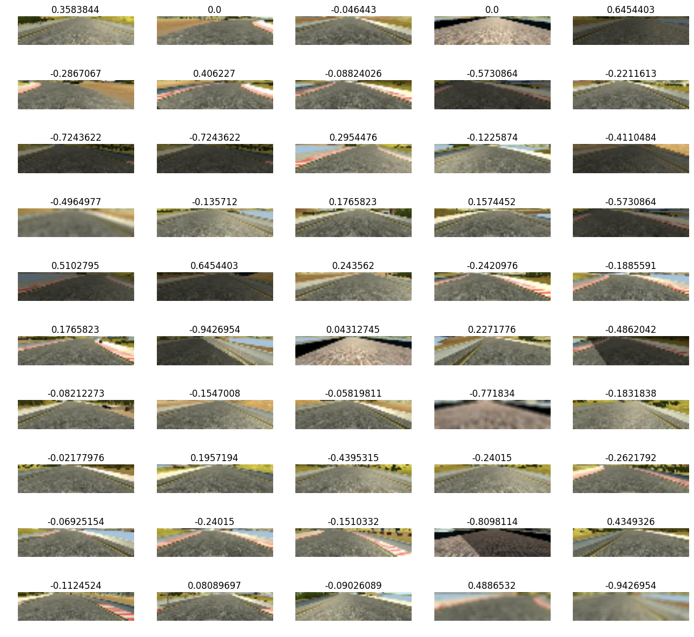
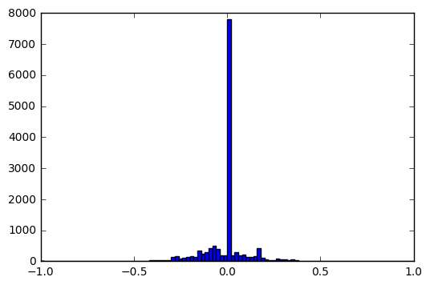
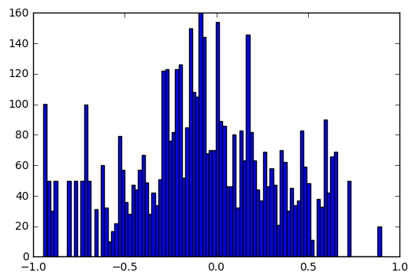

## Overview of the processed dataset:


```python
import numpy as np
from matplotlib import pyplot as plt
%matplotlib inline
import pandas as pd
import math
import cv2
from sklearn import model_selection
from utils import plot_imgs
```


```python
xs, ys = np.load('./xs.npy'), np.load('./ys.npy')
```


```python
data_path = './data/'
df = pd.read_csv(data_path + 'driving_log.csv')
steerings = df.ix[:,3]
steering_abs = np.absolute(steerings)
```

### Below are some samples from the balanced dataset: 


```python
indices = np.random.randint(ys.shape[0], size=50)
plot_imgs(xs[indices], ys[indices])
```


    <matplotlib.figure.Figure at 0x1ce4e226320>





### Below is the distribution of the original data:


```python
hist = plt.hist(steerings, bins=100)
```





### Below is the distribution of the processed and balanced data.

I balanced the data by assigning the absolutes of the steering angles into 100 bins where in each bin the samples range from 50 to 100 maximal.


```python
hist = plt.hist(ys, 100)
```





In the interval of larger steering angles where the samples are scarce I augment the images by randomly adjusting the brightness, applying smooth filter and adding patches. (see the samples picked randomly above)
